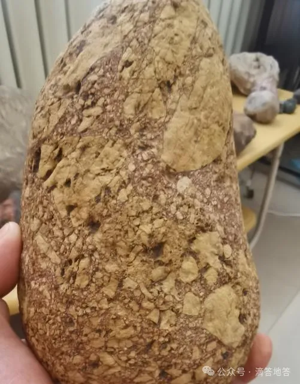

Original 倪振豪 *2025年02月01日 19:18* *山东*

> 2）常见造岩矿物的鉴定（橄榄石、辉石、角闪石、黑云母、斜长石、正长石、石英、石榴子石、绿泥石、白云母、方解石等）；
> 
>   
> 
> 3）肉眼鉴定岩石的基本方法（相关概念：颜色、结构、构造、矿物成分）；
> 
>   
> 
> 4）常见岩石的辨认：沉积岩（砾岩、砂岩、细砂岩、粉砂岩、页岩、石灰岩、鲕状灰岩、竹叶状灰岩、生物碎屑灰岩、泥灰岩、白云质灰岩）；岩浆岩（玄武岩、安山岩、流纹岩、黑曜岩、浮岩、火山集块岩、橄榄岩、辉长岩、闪长岩、花岗岩、闪长玢岩、花岗斑岩、石英斑岩、煌斑岩、伟晶岩、细晶岩）；变质岩（红柱石角岩、千枚岩、板岩、石榴石云母片岩、绿泥石片岩、片麻岩、角闪岩、麻粒岩、榴辉岩、大理岩）；
> 
> https://ceso.ssoc.org.cn/about/show.php?lang=cn&id=267

  

本文下载链接已放在结尾，需要可以自取

沉积岩

1.砾岩

  

o 特性 ：由直径大于2毫米的圆状或次圆状砾石胶结而成。

o 成分 ：主要由石英、长石、岩屑等组成。

2.砂岩

  

o 特性 ：由直径0.0625至2毫米的砂粒胶结而成。

o 成分 ：主要成分为石英、长石、岩屑等。

3.细砂岩

  

o 特性 ：颗粒较细，介于砂岩和粉砂岩之间。

o 成分 ：主要为石英、长石、岩屑等。

4.粉砂岩   

5.

o 特性 ：由直径0.0039至0.0625毫米的粉砂粒胶结而成。

o 成分 ：主要为石英、长石、粘土矿物等。

6.页岩  

o 特性 ：由粘土矿物压实而成，具有层理结构。

o 成分 ：主要为粘土矿物、石英、长石等。

7.石灰岩  

o 特性 ：主要由碳酸钙组成，常见生物化石。

o 成分 ：主要为方解石、少量白云石等。

8.鲕状灰岩  

o 特性 ：含有鲕粒（小球状结构）。

o 成分 ：主要为方解石、少量白云石等。

9.竹叶状灰岩  

o 特性 ：含有竹叶状结构的碎屑。

o 成分 ：主要为方解石、少量白云石等。

10.生物碎屑灰岩

  

o 特性 ：含有大量生物碎屑。

o 成分 ：主要为方解石、生物碎屑等。

11.泥灰岩

  

o 特性 ：介于石灰岩和粘土岩之间。

o 成分 ：主要为方解石、粘土矿物等。

12.白云质灰岩  

o 特性 ：含有较多白云石。

o 成分 ：主要为方解石、白云石等。

岩浆岩

1.玄武岩  

o 特性 ：细粒致密，常呈黑色或暗绿色。

o 成分 ：主要为辉石、斜长石等。

2.安山岩  

o 特性 ：中等粒度，常呈灰色或绿色。

o 成分 ：主要为斜长石、角闪石等。

3.流纹岩  

o 特性 ：细粒至玻璃质，常呈浅色。

o 成分 ：主要为石英、长石等。

4.黑曜岩  

o 特性 ：玻璃质，常呈黑色。

o 成分 ：主要为二氧化硅。

5.浮岩  

o 特性 ：多孔轻质，常呈白色或灰色。

o 成分 ：主要为二氧化硅。

6.火山集块岩  

o 特性 ：含有大量火山碎屑。

o 成分 ：主要为火山碎屑、熔岩等。

7.橄榄岩  

o 特性 ：粗粒，常呈绿色。

o 成分 ：主要为橄榄石、辉石等。

8.辉长岩  

o 特性 ：粗粒，常呈黑色或暗绿色。

o 成分 ：主要为辉石、斜长石等。

9.闪长岩  

o 特性 ：中等粒度，常呈灰色或绿色。

o 成分 ：主要为斜长石、角闪石等。

10.花岗岩  

o 特性 ：粗粒，常呈浅色。

o 成分 ：主要为石英、长石、云母等。

11.闪长玢岩  

o 特性 ：斑状结构，基质细粒。

o 成分 ：主要为斜长石、角闪石等。

12.花岗斑岩  

o 特性 ：斑状结构，基质细粒。

o 成分 ：主要为石英、长石、云母等。

13.石英斑岩  

o 特性 ：斑状结构，基质细粒。

o 成分 ：主要为石英、长石等。

14.煌斑岩  

o 特性 ：斑状结构，基质细粒。

o 成分 ：主要为长石、辉石等。

15.伟晶岩

  

o 特性 ：粗粒，常含有大晶体。

o 成分 ：主要为石英、长石、云母等。

16.细晶岩  

o 特性 ：细粒，常呈浅色。

o 成分 ：主要为石英、长石等。

变质岩

1.红柱石角岩  

o 特性 ：含有红柱石晶体。

o 成分 ：主要为红柱石、石英、长石等。

2.千枚岩

  

o 特性 ：具有千枚状构造。

o 成分 ：主要为绢云母、石英等。

3.板岩

  

o 特性 ：具有板状构造。

o 成分 ：主要为粘土矿物、石英等。

4.石榴石云母片岩  

o 特性 ：含有石榴石和云母。

o 成分 ：主要为石榴石、云母、石英等。

5.绿泥石片岩  

o 特性 ：含有绿泥石。

o 成分 ：主要为绿泥石、石英等。

6.片麻岩  

o 特性 ：具有片麻状构造。

o 成分 ：主要为长石、石英、云母等。

7.角闪岩  

o 特性 ：含有角闪石。

o 成分 ：主要为角闪石、斜长石等。

8.麻粒岩  

o 特性 ：粗粒，常呈黑色或暗绿色。

o 成分 ：主要为辉石、斜长石等。

9.榴辉岩  

o 特性 ：含有石榴石和辉石。

o 成分 ：主要为石榴石、辉石等。

10.大理岩  

o 特性 ：由石灰岩或白云岩变质而成。

o 成分 ：主要为方解石、白云石等。

图片来源于网络，如有错误敬请指正。

通过网盘分享的文件：岩石鉴别.docx

链接: https://pan.baidu.com/s/1p1Qc5xZsCN5RuZeUKj17yA?pwd=5vjj 提取码: 5vjj

\--来自百度网盘超级会员v3的分享

  

个人观点，仅供参考个人观点，仅供参考 继续滑动看下一个

向上滑动看下一个 [Got It](https://mp.weixin.qq.com/s/): ， ， ， ， ， ， ， ， ， ， ， ，.Video Mini Program Like ，轻点两下取消赞 Wow ，轻点两下取消在看 Share Comment Favorite 听过