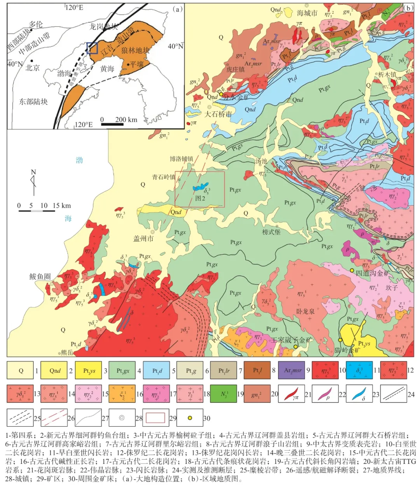

*2025年03月24日 21:20* *浙江*

  

辽宁大东沟超大型低品位金矿的发现及地质意义

李勇 1 ，王东波 1 ，樊金虎 1 ，李浩 1,2 ，刘显高 1 ，梁维天 1,3 ，王鹏 1

1 辽宁省第五地质大队有限责任公司

2 中国地质大学(北京)深时数字地球前沿科学中心

3 中南大学地球科学与信息物理学院

第一作者： 李勇 ，教授级高级工程师，主要从事矿产勘查、找矿理论等方面的研究。

导读：

大东沟金矿 是我国近年来新发现的一处超大型低品位金矿床， 位于辽宁省盖州市青石岭镇与大石桥市博洛铺镇交界处，主矿体位于青石岭镇一侧。

该矿床由辽宁省第五地质大队勘查发现。

1983年及1989至1990年，曾开展金矿普查， 在地表及浅部发现金矿化线索，圈定了多条金矿（化）体 ，但规模有限、品位不高。

2009年再次普查时， 发现原先圈定的小规模矿（化）体之间的围岩普遍具有不同程度的矿化蚀变， 含金量可达0.3～0.5g/t或更高。 认为地表出露的多条含金蚀变带实则为一个整体 ，矿区可能存在东西延长超3,000 m、近南北宽约1,500 m的“大东沟含金构造蚀变岩带” 。 随即将寻找构造蚀变岩（含石英细脉-网脉）型金矿作为主攻方向， 施工2条勘探线共19个钻孔，孔深500～600 m，基本为全孔矿化。 按一般工业指标圈定矿体， 提交金资源量（333）6.4 t，矿床平均品位2.03g/t，初步确立大东沟矿床具有超大型金矿找矿潜力，比照目前在采低品位金矿床圈连矿体， 预测矿区金资源量可达1,000 t以上。  

2024年在矿区开展新一轮勘查工作时，采取普详勘合并的方式。目前，所有施工钻孔全部见矿， 控制的大东沟含金构造蚀变岩带 东西长度大于3 000 m，南北宽度大于2 500 m，垂向最大厚度500 m， 在勘探线剖面上略呈背形状。 按边界品位Au≥0.3g/t、最低工业品位Au≥0.5g/t试圈矿体 ，矿床金资源量 已超过1,000 t，达到 巨型规模 。 大东沟金矿有望成为我国首个单体千吨级（低品位）金矿床， 且矿石选冶技术指标较好，矿体埋藏浅，经济潜力巨大 。

大东沟金矿 以其低含金品位、大规模、明显的层控属性和后期热液叠加改造为特征，因地质特征独特 已被称之为“大东沟式”金矿 。 其矿床学意义深远， 深入研究 将为辽东金矿矿集区同类型金矿的找矿实现更大突破 提供参考， 同时也为其他地区金矿的勘查与找矿提供有益启示。  

基金项目： 辽宁省地矿集团项目资助（编号：JT202401）

说明： 参考文献以原文 为准， 本推文未作详细标注。

\------ 内容提纲 \------

1 概 况

2 区域地质背景及矿区地质

3 矿床地质

4 大东沟金矿地质意义

\-----------

1 概况

大东沟金矿 是 辽宁省第五地质大队 有限责任公司 近年发现的超大型低品位金矿床。 矿区位于辽宁省盖州市青石岭镇与大石桥市博洛铺镇交界处 ，主矿体位于青石岭镇一侧，南距盖州市13 km，北距大石桥市20 km，哈大公路在矿区西侧2 km 处通过， 辽宁省第五地质大队过往发现的猫岭金矿 位于矿区东南方向直距45 km 处 （图1）。区内地形坡度较缓，沟谷多宽阔； 第四系覆盖厚度一般较大，山坡上部基岩多裸露 ，但山坡下部均为果园及农田。 1983 年、1989—1990 年，辽宁省第五地质大队 在该区及周边达子堡、神树山一带（属大石桥市博洛镇管辖） 曾开展金矿普查找矿，在地表及浅部发现金矿化线索，并圈定多条金矿（化）体 ，由于规模有限、含金品位不高，工业价值不大。 2009 年再次在该区开展普查找矿，并取得重要发现： 一是原来圈定的小规模矿（化）体之间的围岩普遍具有强弱不等的矿化蚀变 ，含金可达0.3×10 -6 ～0.5×10 -6 或者更高，可以将原来圈定的矿（化）体和蚀变围岩作为一个矿（化）体整体评价； 二是达子堡一带地表出露的多条含金蚀变带实则应为一个整体 ，并且向东（即0 勘探线以东）隐伏延伸连续1 000 m 左右 ，即“大东沟含金构造蚀变岩带”地表出露加上隐伏推断部分合计东西延长达3 000 m左右，近南北出露最大宽度1 500 m ，并向南北两侧仍有延伸。 因此，辽宁省第五地质大队调整找矿思路，变更普查设计，将寻找构造蚀变岩（含石英细脉-网脉）型金矿作为主攻方向，在0 勘探线施工13 个钻孔，18 勘探线施工6 个钻孔，钻孔深度500～600 m，基本为全孔矿化， 初步确立大东沟矿床具有超大型金矿找矿潜力；在之后提交的普查报告中， 按边界品位Au≥1.0×10 -6 、最低工业品位Au≥1.5×10 -6 ，圈定矿体33 条， 提交金资源量（333）6.4 t，矿床平均品位2.03×10 -6 ； 当时认为，若按边界品位Au≥0.5×10 -6 圈连矿体，0 勘探线至18 勘探线（两线相距720 m）视为矿体连续 （图2），向东西的两侧延长可达推测的3 000 m 左右， 且金品位达到或接近0 勘探线至18 勘探线金矿化强度， 即整个含金构造蚀变岩带金矿化连续稳定的话， 比照目前在采低品位金矿床圈连矿体，矿床金资源量可达1 000 t 以上。 基于以上认识，经专家论证认为大东沟矿床具备快速勘查的条件。 2024 年新一轮勘查过程中采取了普详勘合并的勘查方式，目前所有施工钻孔全部见矿，按边界品位Au≥0.3×10 -6 、最低工业品位Au≥0.5×10 -6 试圈矿体，矿床金资源量超过1 000 t ，大东沟金矿有望成为我国首例单体千吨级（低品位）金矿床。  

图1 大东沟金矿床大地构造位置和区域地质图

图2 大东沟金矿床地质构造简图

2 区域地质背景及矿区地质

大东沟金矿大地构造位于华北克拉通北缘东部 ，胶-辽-吉古元古代造山/活动带辽东段西端（图1（a）和图1（b））， 郯庐断裂在矿区西侧通过 。区域上出露地层 主要有北侧太古界变质表壳岩组合； 中部区为大面积分布的 古元古界低绿片岩相到角闪岩相辽河群变质火山-沉积岩系 ，自下而上依次为浪子山岩组、里尔峪岩组、高家峪岩组、大石桥岩组和盖县岩组；中南部区局部可见中元古界榆树砬子组、新元古界青白口系细河群钓鱼台组不整合覆盖于辽河群之上（图1（b）） 。区域侵入岩主要有古元古代条痕状花岗岩、二长花岗岩、碱性正长岩和基性岩、超基性岩 ； 印支期二长花岗岩、花岗闪长岩、石英闪长岩等 。区域构造极为发育，主要为辽河旋回多幕变形构造叠加形成的复式褶皱构造、 伴生韧脆性断裂构造及印支-燕山期北东向、北北东向、北西向断裂构造，辽河旋回虎皮峪复式背斜控制区域地层展布和构造格架 （图1（b））。  

矿区大面积分布古元古界辽河群盖县岩组二段（Pt 1 gx 2 ） 岩性主要为灰黑色绢云千枚岩、含碳绢云千枚岩、含绿泥石绢云千枚岩 ，局部夹变质石英砂岩（图2）。 地层（S 0 ',S 1 ）产状总体近东西走向 ，南倾，倾角一般为35°～50°，由于岩石能干性弱，受晚期构造影响发生塑性流动，局部地层产状紊乱，呈近南北走向。区内构造较复杂， 主体构造线方向受早期（辽河旋回）构造控制与岩层（S 0 ',S 1 ）一致呈近东西向展布，变形构造主要表现为顺层剪切作用形成的一系列紧闭同斜褶皱或流褶皱； 晚期以破裂构造为主，形成一系列北东向、北北东向、北西向及近东西向的断裂构造，对区内地层产状及早期形成的构造格架影响较大。 特别需要指出的是，伴随郯庐断裂左行运动， 区内发育一组近水平或缓倾斜剪切构造带，宏观上表现为舒缓波状， 在矿区0 勘探线呈宽缓背形状， 向北渐变陡倾斜， 带中密集发育近水平（或缓倾斜）剪切劈理并被硫化物-石英细脉充填 ，靠近剪切带底板见平行产出的酸性及中基性脉岩群， 该近水平剪切构造带是矿区控矿构造，北西向断裂构造与水平剪切构造带叠加部位含金品位较高 。区内岩浆岩较发育，主要有古元古代高丽山斜长花岗岩（2 147±10 Ma）、卧龙岗黑云母石英闪长岩（140.8±1.2 Ma）， 岩体处于矿区近水平剪切构造带上盘，呈超覆侵位产出，岩体周边30～800 m 范围内发育接触变质带 ，带内岩石普遍发育黑云母化、黑云母堇青石角岩化。矿区脉岩发育，主要有云英岩、钠长斑岩、石英斑岩、煌斑岩、闪长玢岩及辉绿岩等。

3 矿床地质

大东沟金矿赋矿地层及岩性 为辽河群盖县岩组二段绢云千枚岩， 矿体受水平（或缓倾斜）剪切构造带控制，矿床以含金品位低、规模大、控矿构造带内金矿化广泛且分布相对均匀 等为特点， 矿床地质特征独特，可称之为“大东沟式”金矿。

含金构造蚀变岩带 主要岩性为含碳质绢云千枚岩 ，地表露头颜色呈灰褐色～红褐色，新鲜面呈浅灰色～灰黑色。 带内岩石矿化蚀变强烈，普通 可见硅化、黄铁矿化、磁黄铁矿化、白铁矿化、毒砂矿化、少量黄铜矿化及广泛的绢云母化、绿泥石化、石墨化、电气石化和碳酸盐化 等， 带内广泛发育褪色蚀变。 以黄铁矿化为主的硫化物多 呈脉状与石英细脉-网脉共生产出，或呈浸染状分布于蚀变岩石中，少数呈团块状、充填角砾状 ，局部可见呈条纹状或层纹状分布。 含硫化物石英细脉-网脉宽度一般为0.5～10 cm，以1～3 cm 宽居多 ，个别宽度可达10 cm 以上； 其发育密度一般为3～10 条/m，密集处可达10～20 条/m 。 硫化物细脉及石英细脉-网脉为沿近水平（或缓倾斜）剪切构造裂隙充填而成 ，地表产状多为北西走向，倾向北东或南西，倾角一般为20°～30°； 在钻孔岩芯中可见硫化物石英细脉轴夹角多在60°～80°之间，个别接近90° 。目前工程控制的大东沟含金构造蚀变岩带，东西长度大于3 000 m，南北宽度大于2 500 m，垂向最大厚度500 m， 在勘探线剖面上略呈背形状，向南倾角趋缓 ，以发育黄铁矿细脉为主，矿化蚀变趋弱； 向北倾角变陡，以发育磁黄铁矿细脉为主 ，矿化蚀变趋强， 有向卧龙岗岩体下部有倾伏延伸趋势 （图3）。  

图3 大东沟金矿床0 勘探线地质剖面图

含金构造蚀变岩带矿化蚀变 连续稳定分布，带内普遍含金 ，金矿化分布相对均匀， 根据矿化蚀变组合及构造特点，肉眼可识别含金矿化蚀变带 ，圈定矿体则需根据样品分析结果而定。 通常矿化蚀变较强、石英细脉密集发育部位含金品位相对较高， 一般为0.5×10 -6 ～1.0×10 -6，部分可达1.0×10 -6 ～3.0×10 -6 ； 矿化蚀变较弱、石英细脉稀疏部位，一般含金低于0.3×10 -6 ～0.5×10 -6 ，但也有个别含金较高的样品。

矿石工业类型为 蚀变岩型和石英硫化物细脉—网脉型的复合类型 。 矿石中主要金属矿物为黄铁矿， 一般含量3%～5%，富集部位可达10%～15% ，次要金属矿物为磁黄铁矿、毒砂，少量白铁矿、黄铜矿、方铅矿、闪锌矿，微量自然铋； 金属氧化物见少量褐铁矿、钛铁矿；金矿物为自然金 。主要脉石矿物为绢云母、石英，其次为绿泥石、长石，少量方解石、白云石、电气石、石墨。 矿石结构以半自形-它形粒状结构为主 ，自形结构、碎裂结构、包含结构、交代结构、填隙结构次之； 矿石构造常见细脉-网脉状构造、条纹条带（层纹）状构造、浸染状构造、致密块状构造。 矿石中Au 为唯一有价元素，伴生有益元素为Ag、Cu、Pb、Zn、S， 其中只有S 局部含量较高，其他元素含量较低； 伴生有害组分As，平均含量0.24% ； 矿石中含石墨及有机碳0.23% 。 金矿物为自然金，赋存状态以粒间金为主，次为裂隙金，包裹金少量 ；嵌布粒度以微、细粒为主，外形形态以浑圆粒状，角粒状、尖角粒状、麦粒状、长角粒状等形态为主，多数呈浸染状分布于绢云母颗粒间或硫化物与脉石矿物粒间，少数赋存在脉石裂隙或硫化物粒间 。初步选矿实验金回收率65%～91%，技术指标较好。  

4 大东沟金矿地质意义

辽东地区是我国重要金矿矿集区， 近年找矿勘查和矿床研究取得重要进展。 辽东金矿矿集区已发现金矿产地92 处，累计查明金矿资源储量430.926 t 。 大东沟千吨级金矿的勘查评价， 将大幅度提高辽宁省金矿资源储量， 极大程度提升辽东金矿矿集区成矿强度 。 大东沟金矿埋藏浅，金矿物赋存状态简单，属于易采易选金矿床，经济潜力巨大 。

大东沟金矿 赋存于盖县岩组二段含碳绢云千枚岩中， 与猫岭金矿一致，具有层控属性，两者矿石类型相似， 但大东沟大规模近水平（缓倾斜）控矿构造特征 明显不同于猫岭金矿等同产于盖县岩组所有金矿床 ，与目前已报道的其他金矿床也无法类比 ，所以大东沟金矿具有特殊的矿床学意义 ； 初步研究认为大东沟金矿为中低温热液矿床， 热液成矿作用发生于早白垩纪， 且经历了古元古代沉积-变质作用的预富集， 但矿床巨量金物质来源，大规模含金构造蚀变带形成机制等关键地质问题有待深入探讨 ，也为研究者提供广阔探索空间。

辽东金矿矿集区盖县岩组地层大面积出露，中生代岩浆活动强烈，构造发育，与之相关的金矿点、矿化线索众多， 有很多地段地球物理、地球化学背景及成矿地质条件与大东沟地区类似，因此，大东沟金矿勘查评价及矿床研究对于今后探寻该类型金矿找矿具有典型的矿床意义，对促进辽东金矿矿集区找矿获得更大的突破将发挥更好的示范作用。

致谢： 大东沟金矿床的发现是在辽宁省自然资源厅、辽宁省地质矿业勘探集团有限责任公司领导下实现的，找矿勘查成果凝聚五队几代地质人的辛勤劳动和智慧结晶，在此向为该项目辛苦付出的所有人致以真诚的敬意！

  

引用格式： 李勇，王东波，樊金虎，等. 辽宁大东沟超大型低品位金矿的发现及地质意义\[J\]. 中国矿业，2025，34（1）：233-238.  

**封面标题、导读评论和排版整理等 **：**** 《覆盖区找矿》公众号.

  

**点击小程序即可下单订购**

继续滑动看下一个

向上滑动看下一个 [Got It](https://mp.weixin.qq.com/s/): ， ， ， ， ， ， ， ， ， ， ， ，.Video Mini Program Like ，轻点两下取消赞 Wow ，轻点两下取消在看 Share Comment Favorite 听过